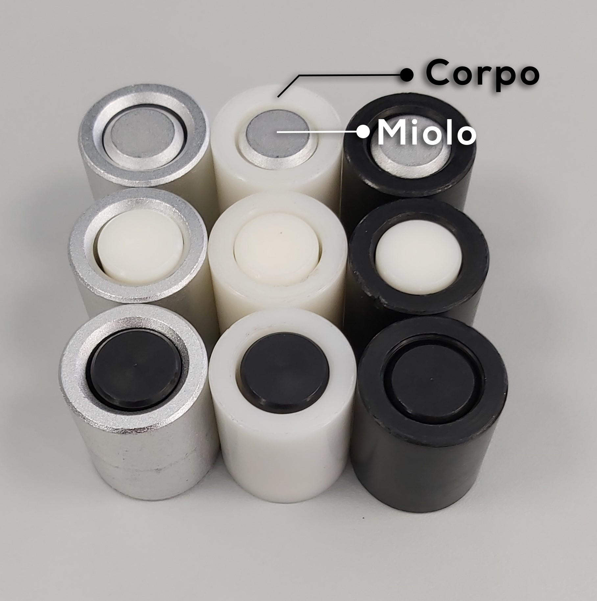
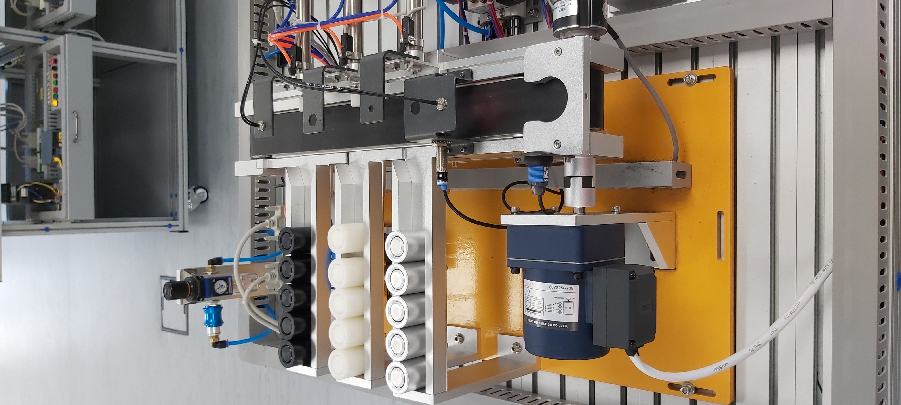
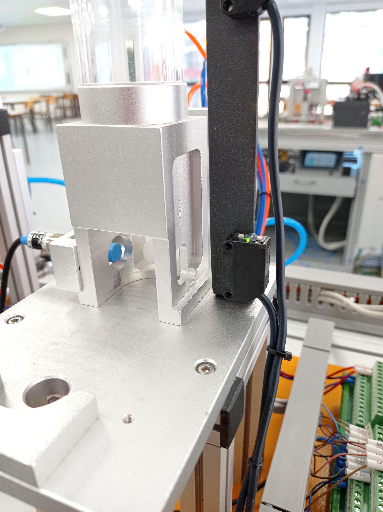
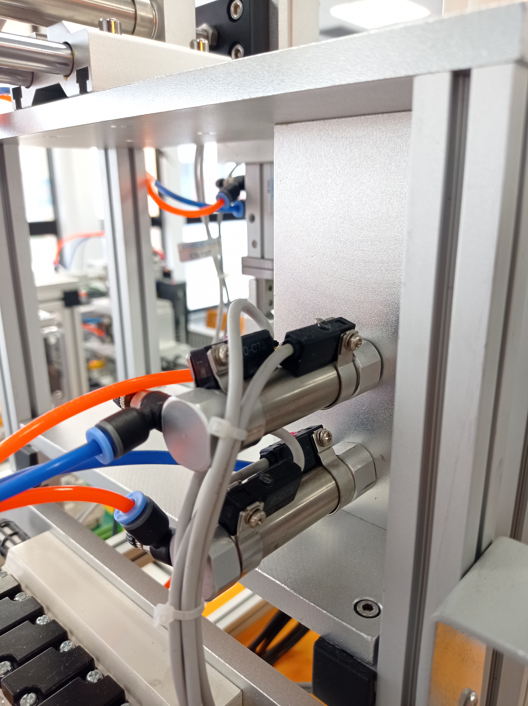
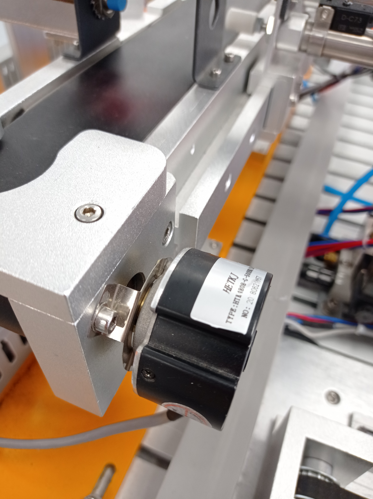
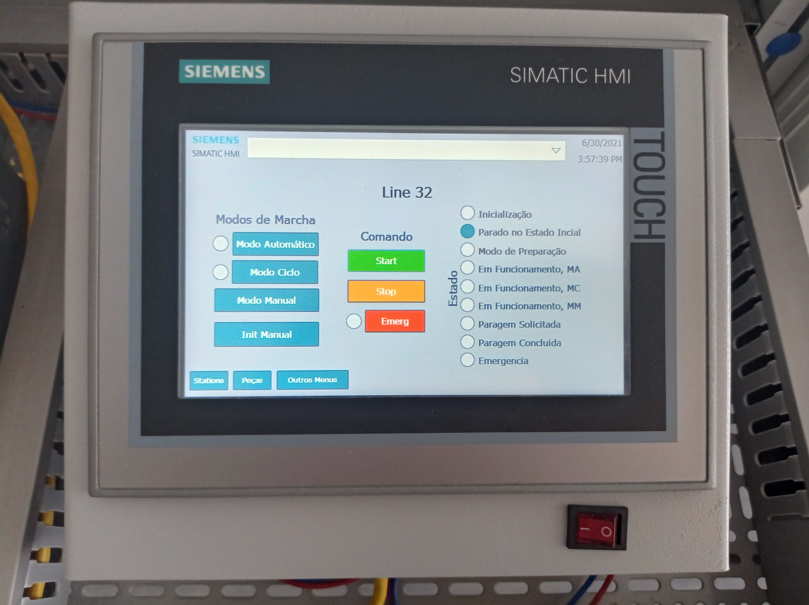
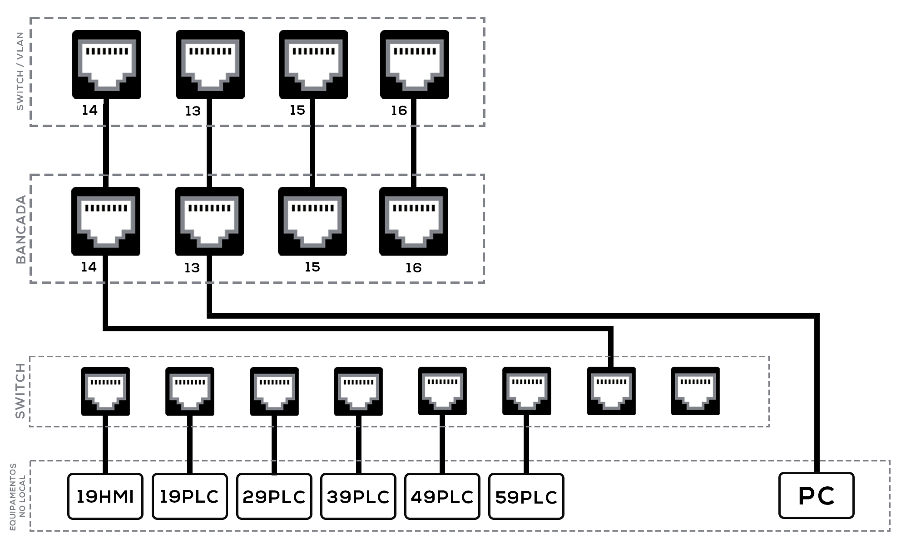
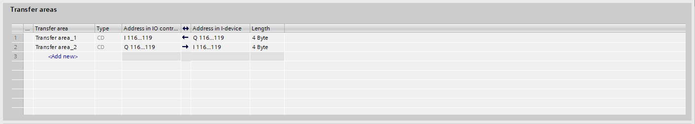

# Grupo 30 - YL335B

- [Introdução](#introducao)
- [Processo](#processo)
    - [Peças](#pecas)
    - [Estações](#estacoes)
      - [Estação 10](#est-estacao-10)
      - [Estação 20](#est-estacao-20)
      - [Estação 30](#est-estacao-30)
      - [Estação 40](#est-estacao-40)
      - [Estação 50](#est-estacao-50)
- [Hardware](#software)        
    - [Componentes](#componentes)
      - [Sensor Fotoelétrico](#sensor-fotoeletrico)
      - [Sensor Magnético](#sensor-magnetico) 
      - [Sensor Indutivo](#sensor-indutivo) 
      - [Sensor Ótico](#sensor-otico) 
      - [Cilindro Pneumático](#cilindro-pneumatico)
    - [Equipamentos](#equipamentos)
      - [Siemens S7 1200](#siemens-s7-1200) 
      - [Enconder](#enconder)
      - [Servo Motor](#servo-motor)
      - [Inversor de Frequência](#inversor-de-frequencia)
      - [HMI](#hmi)
      - [Switch](#switch)
- [Software](#software)
    - [GEMMA](#gemma)
    - [TIA Portal](#tia-portal)
      - [Comunicações](#comunicacoes)
        - [Profinet](#profinet)
        - [Modbus](#modbus)
    - [Tesla Scada](#tesla-scada)
    - [Draw io](#draw-io)
- [Manuais](#manuais)
- [Lines](#lines)
    - [Line 31](#line-31)
      - [2020_2021](#line31_2020_2021)
        - [João Evartisto](https://joaoevaristo-documentacao.readthedocs.io/en/latest/line31.html)
        - [Fábio Santo](https://fabiosanto-documentacao.readthedocs.io/en/latest/line31.html)
      - [2021_2022](#line31_2021_2022)
      - [2022_2023](#line31_2022_2023)
  - [Line 32](#line-32)
      - [2020_2021](#line32_2020_2021)
        - [Luís Barroso](https://luisbarroso-documentacao.readthedocs.io/en/latest/line32.html)
      - [2021_2022](#line32_2021_2022)
      - [2022_2023](#line32_2022_2023)
  - [Line 33](#line-33)
      - [2020_2021](#line33_2020_2021)
      - [2021_2022](#line33_2021_2022)
      - [2022_2023](#line33_2022_2023)

## Introdução

As Linhas 31, 32 e 33, do Grupo 30, dividem-se em 5 estações das quais resultam: **Transporte (Estação 10)**, **Aplicação (Estação 30)**, **Alimentação do Corpo (Estação 20) e do Miolo (Estação 40)** e **Seleção (Estação 50)**.

## Processo

O Grupo 30, consiste num de linhas em que cada uma delas contém um conjunto de estações, **cada uma com Equipamentos/Componentes independentes**. As Linhas 31, 32 e 33, assim com cada uma da estações, funcionam usando **sistemas pneumáticos** e **sistemas eletromecânicos**.

Os **sistemas pneumáticos** estão presentes em todas as estações. Responsáveis pelos movimentos dos Cilindros, o avanço e recuo. Já os **sistemas eletromecânicos** só estão presentes nas estações 10 e 50. Na estação 10, são responsáveis pelo movimento do **robô**. Este robô é utilizado para o transporte das peças pelas diversas estações. Acoplado ao robô, temos uma **garra**, sendo assim possível realizar as tarefas pretendidas, com por exemplo, o avança e recuo da garra. Para se deslocar pelas diversas estações, o robô, está conectado a um **Servo Motor** (Simotics S-1FL6) e um **Inversor de Frequência** (Siemens V90); Na estação 50, são responsáveis pelo movimento do tapete. Para o movimento deste tapete é usado um **Motor Trifásico** que acoplado tem um **Enconder**, que, através da sua posição é possível fazer o encaminhamento das peças. Para a movimento do Motor é utilizado um **Inversor de Frequência** (Siemens G120C), que converte o sinal elétrico em sinal analógico sendo assim possível fazer o movimento do tapete e controlo da velocidade.

Para o controlo das peças são usados Sensores, como: **Sensores Fotoelétricos**, usados para a deteção das peças em determinadas posições; **Sensores Indutivos** usados para distinguir as peças metálicas das peças de plástico; **Sensores Óticos** usados para distinguir a peças brancas das peças pretas e **Sensores Magnéticos** usados para detetar a posição da haste do cilindro.

Para a comunicação entre as diversas estações é usado o protocolo de comunicação **PROFINET**, este protocolo é baseado em **Ethernet**, ou seja, todas as comunicações entre PC/PLC ou PLC/PLC são feitas em rede. No programa TIA Portal é definida uma área de transferência de Bytes, desta forma, tanto o Master com os *Slaves* podem operar na zona definida. 

*Imagem da Linha 32*

### Peças

*Peças*

Peças, constituídas por Corpo (Parte Exterior) e por um Miolo (Parte Interior). Representa o objeto processado na Linha 32, quando os elementos são unificados representam o produto final. Podem ser classificadas de 9 maneiras, como nos mostra a tabela abaixo.

||Metálico|Branco|Preto|
-| ------ | ---- | --- |
Metálico|**x**|x|x|
Branco|x|**x**|x|
Preto|x|x|**x**|

Os **x** a negrito indicam-nos as combinações pretendidas, quando essas combinações são processadas são encaminhadas para o respetivo armazém.

### Estações
#### Estação 10

A Estação 10, **estação de transporte da peça**, desde a sua fase inicial até à sua finalização. A Estação 10 é constituída por 7 sensores e 6 cilindros, dos quais resultam: Sensor de Garra em baixo, Sensor de Garra em cima, Sensor de Garra de rotação à esquerda, Sensor de Garra de rotação à direita, Sensor de Garra avançada, Sensor de Garra recuada, Sensor de Garra fechada; Cilindro de Garra subida e descida, Cilindro de rotação à esquerda da Garra, Cilindro de rotação à direita da Garra, Cilindro de Garra avançada e recuada, Cilindro de fecho da Garra, Cilindro de abertura da Garra.

*Estação 10*

#### Estação 20

A Estação 20, **estação de alimentação do corpo da peça**, o corpo da peça, é colocado no funil para ser processado. A Estação 20 é constituída por 8 sensores e 2 cilindros, dos quais resultam: Sensor de Peça à Frente, Sensor Cilindro1 Avançado, Sensor Cilindro1 Recuado, Sensor Cilindro2 Avançado, Sensor Cilindro2 Recuado, Sensor no Funil (Cima), Sensor no Funil (Baixo), Sensor de Peça Metálica; Cilindro 1, Cilindro 2.

*Estação 20*

#### Estação 30

A Estação 30, **estação de aplicação**, é aplicada uma *cola* para fixar o miolo ao corpo da peça. A Estação 30 é constituída por 7 sensores e 6 cilindros, dos quais resultam: Sensor de peça na Pinça, Sensor de Pinça aberta e fechada, Sensor de Pinça avançada, Sensor de Pinça recuada, Sensor de Prensa subida, Sensor de Prensa descida; Cilindro de fecho da Pinça, Cilindro de Pinça avançada e recuada, Cilindro da Prensa subida e descida.

*Estação 30*

#### Estação 40

A Estação 40, **estação de alimentação do miolo da peça**, o miolo da peça, é colocado na funil para ser processado. A Estação 40 é constituída por 16 sensores e 6 cilindros, dos quais resultam: Sensor Cilindro1 Avançado, Sensor Cilindro1 Recuado, Sensor Cilindro2 Avançado, Sensor Cilindro2 Recuado, Sensor Prato de rotação à esquerda, Sensor Prato de rotação à direita, Sensor copo em cima, Sensor copo em baixo, Sensor do Prato à esquerda, Sensor do Prato à direita, Sensor de Garra avançada, Sensor de Garra recuada, Sensor de Garra subida, Sensor de Garra descida, Sensor de Garra fechada, Sensor de Peça à frente; Cilindro 1, Cilindro 2, Cilindro Prato, Cilindro da Garra avançada e recuada, Cilindro da Garra subida e descida, Cilindro da Garra aberta e fechada.

*Estação 40*

#### Estação 50

A Estação 50, **estação de seleção**, responsável por ordenar as peças no respetivo armazém.  Estação 40 é constituída por 6 sensores e 3 cilindros, dos quais resultam:
Sensor de Peça no Tapete, Sensor de Peça Metálica, Sensor de Peça Branca/Metálica, Sensor Cilindro1 Avançado, Sensor Cilindro2 Avançado, Sensor Cilindro3 Avançado; Cilindro 1, Cilindro 2, Cilindro 3.

*Estação 50*

## Hardware
### Componentes
#### Sensor Fotoelétrico

Os sensores fotoelétricos são sensores que usam um feixe de luz para detetar a presença/ausência de objetos. Quando algum objeto  interrompe esse feixe de luz, o recetor deteta esse objeto e realiza a sua função para que foi programa, como por exemplo, o avanço de um cilindro.

Este tipo de sensor podem ser aplicado de 2 maneiras diferentes:

  - Sensor Fotoelétrico de Barreira, 2 sensores distintos (emissor/recetor). Normalmente são instalados frente a frente, desta forma, sempre que este feixe for interrompido, resulta numa ação. 
  - Sensor Fotoelétrico Retrorreflexivo, 1 único sensor com emissor/recetor no mesmo **"corpo"**. A este tipo de sensor é acrescentado um espelho prismático. O seu funcionamento é idêntico ao funcionamento do *Sensor Fotoelétrico de Barreira*.

*Imagem do Sensor Fotoelétrico*

#### Sensor Magnético

Os sensores magnético são sensores que nos permitem saber em que posição a haste do cilindro se encontra, ou seja, avançado ou recuado. O sensor magnético funciona na presença de um campo magnético externo, próximo e dentro da área sensível. 

*Imagem do Sensor Magnético*

#### Sensor Indutivo

Os sensores indutivos, são sensores que nos permitem e distinção entre as peças metálicas e as peças de plástico. O sensor indutivo funciona a partir de um campo eletromagnético. Quando a peça metálica entra neste campo, devido à indução no metal ocorre uma diminuição na energia do campo, desta forma, o sensor deteta a presença de objeto metálico.

*Imagem do Sensor Indutivo*

#### Sensor Ótico

Os sensores óticos, são sensores que nos permitem a diferenciação entre peça branca e preta. O seu principio de funcionamento é parecido ao do **"Sensor Fotoelétrico"**, ou seja, o sensor possui um emissor e recetor, no mesmo corpo. Assim que a peça entra no campo do sensor, um feixe de luz é refletido e parte da luz emitida. A quantidade de luz refletida vai definir se a peça é branca ou preta. O sensor é composto por duas partes: o sensor e um amplificador ótico.

*Imagem do Sensor Ótico*

#### Cilindro Pneumático

O cilindro pneumático é o componente responsável por fazer movimentar as peças ao longo do processo. Estes componentes trabalham a partir de ar comprimido, ou seja, nas suas extremidades possuem pequenos orifícios, sendo assim possível, mover a haste para frente e para trás, alternando a entrada que recebem o ar. Na Oficina Luban, mais especificamente no Grupo 30 (YL-335B), os cilindros pneumáticos usados são de duplo efeito.

*Imagem do Cilindro Pneumático*

### Equipamentos
#### Siemens S7 1200

Siemens S7 1200, é um equipamento eletrónico, produzido pela Siemens. Consiste no PLC (Controladores Lógicos Programáveis) capaz de controlar uma variedade de aplicações de automação. Na Oficina Luban, mais especificamente no Grupo 30 (YL-335B), este equipamento, é o **"cérebro"** de todos o processo. Responsável por processar e realizar as ordens recebidas pelo seu operador. É o PLC ideal quando se trata de executar tarefas de automação com flexibilidade e eficiência. Eles apresentam uma gama abrangente de funções tecnológicas e comunicação integrada, bem como um design especialmente compacto e compacto.

*Imagem do Siemens S7 1200*

#### Encoder

Encoders são equipamentos eletromecânicos, utilizados para conversão de movimentos rotativos ou deslocamentos lineares em impulsos elétricos de onda quadrada, que geram uma quantidade exata de impulsos por volta em uma distribuição perfeita dos pulsos ao longo dos 360 graus do giro do eixo. Os enconders podem ser classificados como **"Encoders Relativos"** ou **"Encoders Absoluto"**. **"Encoder Relativos"**, dizem-nos a posição relativa ao ponto onde o encoder foi ativado, normalmente possuem 3 saídas A, B e Z. **"Encoder Absolutos"**, dizem-nos a posição absoluta através de saídas digitais codificadas em um valor binário.

*Imagem do Encoder*

#### Servo Motor

Um Servo Motor, é um equipamento eletrónico utilizado como um atuador em sistemas de controlo automático, ele converte sinais elétricos num movimento angular no veio do motor. Na Oficina Luban, mais especificamente no Grupo 30 (YL-335B), o Servo Motor esta ligado a um Motor AC SIMOTICS S-1FL6 que permite a deslocação do carro.

*Imagem do Servo Motor*

#### Inversor de Frequência

Um Inversor de Frequência é um equipamento eletrónico, utilizado para variar a velocidade de um motor. Este equipamento transforma o Sinal Analógico, vindo do PLC, em corrente alternada. Na Oficina Luban, mais especificamente no Grupo 30 (YL-335B), o Inversor de Frequência esta ligado a um Motor Triásico e a este está acoplado um Enconder que permite as seleção das peças de forma correta e precisa. 

*Imagem do Inversor de Frequência*

#### HMI

HMI, Human Machine Interface (Interface Homem-Máquina), consiste num painel que permite o operador comunicar com a máquina. Na Linha 32 existem dois tipos de HMI: 
- **HMI Painel**, consiste num Painel com 3 Luzes de Sinalização: Vermelho, Verde, Amarelo e 4 Botões: dois botões Switch, usados normalmente para o Start e Stop; um Seletor e um botão de emergência. 
- **HMI Touch**, ao contrário da HMI Painel, fornece a componente gráfica, sendo assim possível adicionar botões, iluminação, gráficos, imagens consoante a necessidade do seu operador, tornando-se assim uma ferramenta bastante versátil e eficiente.

*Imagem da HMI Painel*

*Imagem da HMI Touch*

#### Switch

Um Switch consiste num equipamento ativo que permite a interligação entre vários equipamentos. Os Switches têm a capacidade de registar o Endereço MAC dos dispositivos que estão ligados a ele, desta forma, a informação recebida pelo Switch é enviada para o dispositivo pretendido e não para todos os dispositivos com acontecer por exemplo com os Hubs. Na Linha 32 o Switch é responsável por fazer a interligação dos cinco PLC’s e da HMI, que por sua vez, está conectado á segunda porta da Bancada e na primeira porta está ligado o PC.

*Imagem do Switch*

*Esquema de Rede do Grupo 30*

## Software
### Gemma
O Gemma consiste num Guia de estudo dos modos de Marcha e Paragem. Num processo automatizado, por necessidade, é necessário prever todos os estados possíveis, desta forma, com o Gemma, é possível executar arranques ou paragens de forma segura sem prejudicar ou Homem ou a Máquina.

Como podemos observar na figura a baixo, o Gemma, divide-se em 3 grande blocos: **"Procedimentos de paragem"**, **"Procedimentos de execução"**, **"Procedimentos de falha"** e a cada um dele correspondem um conjunto de funções/tarefas.

---

**Procedimentos de Paragem**
  - **A1 - Parado no estado inicial**: O processo já foi iniciado e está pronto a começar.
  - **A2 - Fim de ciclo solicitado**: O processo encontra-se em produção, assim que chegar ao final do ciclo volta ao estado inicial.
  - **A3 - Paragem solicitada**: O processo entra em paragem no seu estado atual (Não coincide com o fim do ciclo). Esta paragem ocorre devido alguma falha/erro na produção continua.
  - **A4 - Paragem finalizada**: Diz-nos que a paragem solicitada foi concluída, desta forma, o processo está pronto a começar.
  - **A5 - Preparação para retomar**: Neste estado, procedem todas as operações, que deram origem à Paragem de Emergência ou Diagnóstico/tratamento de falha desde: limpeza, substituição/reparação de uma peça/produto, entre outros.
  - **A6 - Colocação no estado inicial**: Neste estado, procedesse a inicialização do sistema.
  - **A7 - Colocação em estado específico**: O processo é retornado para uma posição específica, quando não é necessário voltar ao estado inicial.

**Procedimentos de execução**
  - **F1 - Marcha de produção COM ordem**: Neste estado, o processo produz normalmente. Aqui as tarefas para as quais o processo foi desenvolvido devem ser realizadas, corresponde ao Modo Automático.
  - **F2 - Marcha de preparação**: Corresponde as ações necessárias para a máquina entrar produção.
  - **F3 - Marcha de finalização**: Corresponde ao conjunto de ações necessárias que o processo deve realizar antes de parar.
  - **F4 - Marchas de verificação SEM ordem**: O processo, opera por ordem do operador, pode realizar qualquer movimento. Corresponde ao Modo Manual, normalmente usado para funções de controle manutenção e verificação.
  - **F5 - Marchas de verificação COM ordem**: O processo, realiza o ciclo completo de operação em ordem. Corresponde ao Modo Semi - Automático, normalmente usado para manutenção e verificação de possíveis erros não encontrados na Marchas de TESTE.
  - **F6 - Marchas de TESTE**: Nesse estado, realizam-se operações de ajuste e manutenção preventiva.

**Procedimentos de falha**
  - **D1 - Paragem de emergência**:  Neste estado, por imposição do Homem ou do Processo, o processo entra em emergência, desta forma, evita-se e reduz-se o perigo.
  - **D2 - Diagnóstico/tratamento de falha**: O processo, é examinado após uma falha. Esta falha pode ser tratada com ou sem a intervenção do operador. Quando concluída o processo está pronto para reiniciar.
  - **D3 - Produção em estado de emergência**: O processo, mesmo encontrando-se em emergência, pode continuar a operar. Um exemplo, falta uma peça, essa falta origina um alarme mas não uma paragem total do processo, isto porque, pode ser rapidamente substituída ou não revela ser fundamental para o produto final.

### TIA Portal
[TIA Portal](https://new.siemens.com/global/en/products/automation/industry-software/automation-software/tia-portal.html), Totally Integrated Automation Portal, desenvolvido pela Siemens é um software que oferece uma vasta gama ferramentas, desta forma é possível realizar o trabalho de forma rápida e eficaz. Integrado ao TIA Portal temos o WinCC, a ferramenta utilizada para a programação das HMI's na Ofina Luban.

#### Comunicações
##### Profinet

Profinet é um protocolo de comunicação baseado em Ethernet, este protocolo destina-se ao controle de dispositivos de campo como: Cilindros, Motores, Inversores, Válvulas, Sensores, entre outros. O Profinet, é um protocolo de comunicação de Send/Receive que utiliza um relacionamento Master/Slave. Este tipo de comunicação é usado no Grupo 30 para todas as estações comunicarem entre si e executaram as suas tarefas de forma eficiente. 

Por defeito o PLC da ST10, é definido como o PLC Master, responsável por receber e enviar ordens de todas as estações, que foram definidas como Slaves. Nos PLC's definidos como Slaves é necessário definir uma Área de Transferência de Bytes, para que estas comunicações ocorram de forma segura e eficaz. Para isso, *Device Configuration > Dois Cliques no PLC > General > Operation Mode*, em **Assigned IO Controller**, devemos colocar o PLC Master, por defeito, o PLC da ST10; **Device Number**, deve ser diferente para cada uns dos PLCs da Linha.

*Área de Transferência de Bytes*

##### Modbus

ModBus é um protocolo de comunicação de Send/Receive que utiliza um relacionamento Master/Slave. A comunicação Master/Slave ocorre em pares, ou seja, assim que o Slave fizer um pedido, fica a aguardar a resposta por parte do Master. Assim que Master receber este pedido envia a informação pretendida para o Slave. O Modbus é constituído por 4 zonas de memorias, como mostra a tabela abaixo. 

| Tipo de Objeto     | Acesso     | Tamanho     | Espaço de Endereços     |
| ------------------ | ---------- | ----------- | ----------------------- |
| Holding Coil       | Read-write | 1 bit       | 00001 - 09999           |
| Discrete input     | Read-only  | 1 bit       | 10001 - 19999           |
| Input register     | Read-only  | 16 bits     | 30001 - 39999           |
| Holding register   | Read-write | 16 bits     | 40001 - 49999           |

Este protocolo de comunicação é usado pelo software Tesla Scada, permitindo assim que ordens para a linha ou para as Estações sejam dadas remotamente.

*Área de Transferência de Bytes*

### Tesla Scada
[Tesla Scada](https://teslascada.com/), foi o software escolhido para implementação de interfaces homem-máquina na Oficina Luban. O Tesla Scada permite o controlo e supervisão em tempo real de sistemas e processos industriais baseados em PLC. 

### Draw io
[Draw.io](Draw.io), é um software gratuito que permite a criação de Grafcets, Fluxogramas, entre outras.

## Manuais

Alguns manuais importantes para a programação da linhas 31, 32 e 33.

- [Manual Enconder](./equipments/manuais/manual_enconder.md)
- [Manual Servo Motor](./equipments/manuais/manual_servo.md)
- [Siemens S7 S7-1200](https://cache.industry.siemens.com/dl/files/465/36932465/att_106119/v1/s71200_system_manual_en-US_en-US.pdf) 
- [Modbus - MB_CLIENT e MB_SERVER](https://cache.industry.siemens.com/dl/files/380/94766380/att_57741/v1/net_modbus_tcp_s7-1500_en.pdf)
    
## Lines
### Line 31
#### 2020_2021

- [João Evartisto](https://joaoevaristo-documentacao.readthedocs.io/en/latest/line31.html)
- [Fábio Santo](https://fabiosanto-documentacao.readthedocs.io/en/latest/line31.html)

#### 2021_2022

#### 2022_2023

### Line 32
#### 2020_2021

- [Luís Barroso](https://luisbarroso-documentacao.readthedocs.io/en/latest/line32.html)

#### 2021_2022

#### 2022_2023

### Line 33
#### 2020_2021

#### 2021_2022

#### 2022_2023

