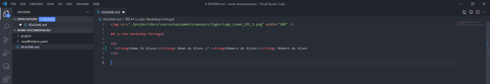
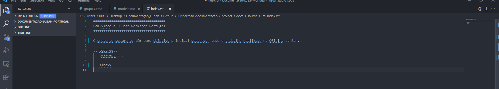

<h2>IPS - Escola Superior de Tecnologia de Setúbal - Lu Ban Workshop Portugal
</h2>
  
  

# Modelo

**Autor:** Luis Barroso

## Índice
- [Objetivo](#objetivo)
- [Localização](#Localização)
- [Alteração dos Parâmetros](#Alteração-dos-Parâmetros)	
- [Ficheiros](#Ficheiros)

### Objetivo

Para facilmente criar documentação para a Lu Ban Workshop Portugal, foi criado um modelo de documentação. Desta forma não será necessário criar toda a estrutura envolvente. Este manual têm como objetivo explicar: como obter o modelo; alterações dos parâmetros; onde guardar toda a sua documentação.

### Localização

Este modelo pode ser obtido no repositório principal: [Github- Repositório Principal](https://github.com/luismbarroso/Documentacao-LuBan-Portugal/tree/main/modelo)

### Alteração dos Parâmetros

Para que o documento criado, seja facilmente identificado e distinguido dos restante são necessárias fazer algumas alterações, que passaremos a explicar.

    Nota: Todos os 'xx' apresentados ao longo deste documento, devem ser subsituidos por numeração real, como por exemplo o número da Line e as datas.

1.No ficheiro **“README.md”**, localizado na raiz do repositório, altere o **“Nome do Aluno”** e o **“Número do Aluno”** para os seus dados.

2.No ficheiro **“config.py”**, localizado em **“./project/docs/source/conf.py”** altere os seguintes parâmetros:

    copyright = '20xx, Nome do Aluno'
    author = 'Nome do Aluno'
    "repo_url": "https://github.com/../..",
    "repo_name": "Nome do Aluno - Documentação ",

- **Copyright** - Correponde ao ano de criação do documento e o seu autor, apresentados no final da página.
- **Author** - Como o nome diz, corresponde o autor do documento.
- **Repo_url** - Correponde ao URL do repositório onde estão alocados os ficheiros do Github.
- **Repo_name** - Correponde ao que aparecerá na Navbar, relativo ao R repositório alocados no Github.

3.No ficheiro **index.rst”**, localizado em **“./project/docs/source/index.rst”** altere o ficheiro **“linexx”** para o nome da line que está a trabalhar. Por exemplo, se está a trabalhar na Line32, o ficheiro, deve estar nomeado como **line32.md”** e dentro do ficheiro **index.rst”**, onde está **“linexx”** deve alterar para **line32”**.

### Ficheiros

Toda a documentação deve ser guardada na pasta Line_xx, onde **"xx"** representa o número da Line onde se encontra a trabalhar e também representa o ano que a sua documentação está a ser criada, este pasta pode ser encontrada em **"./lines/line_xx/20xx_20xx"**.