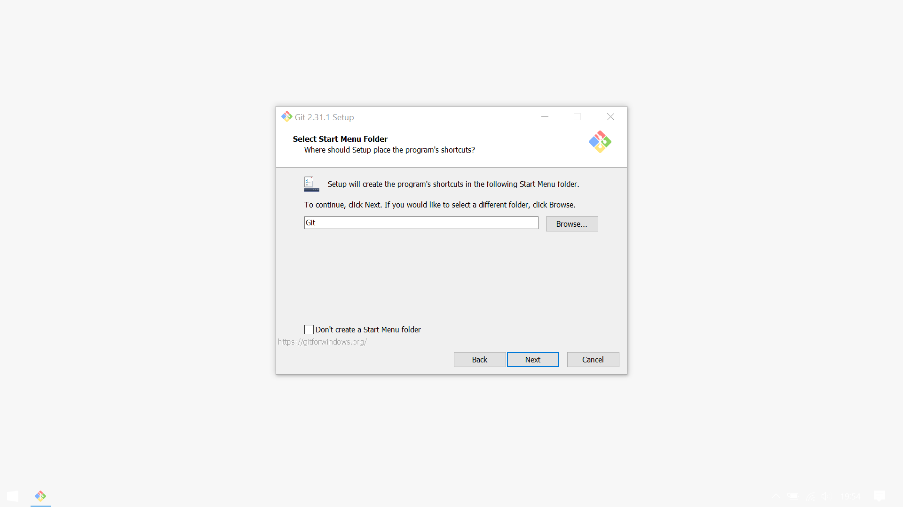
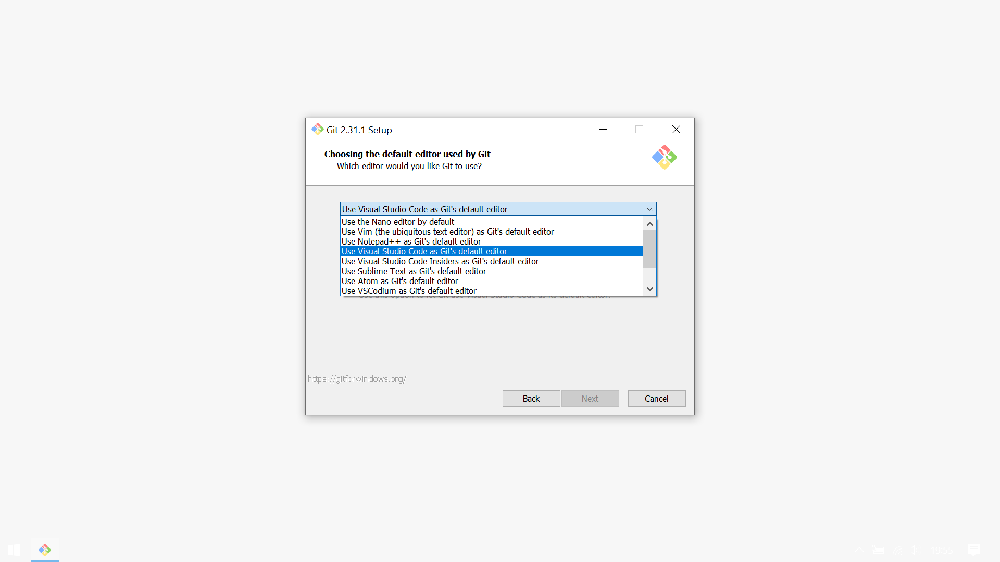
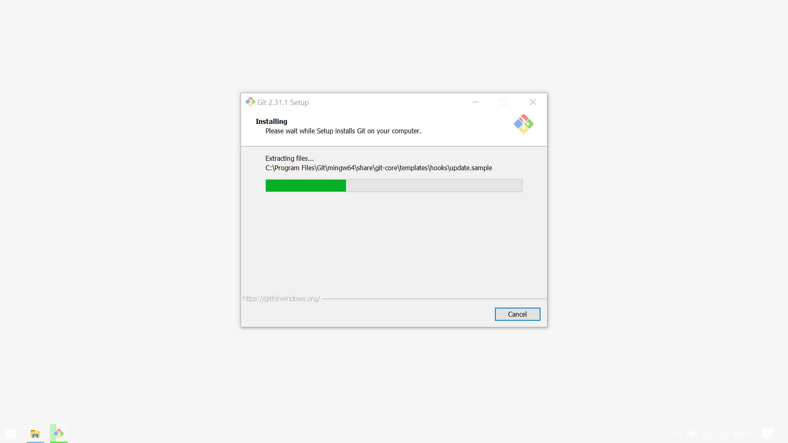
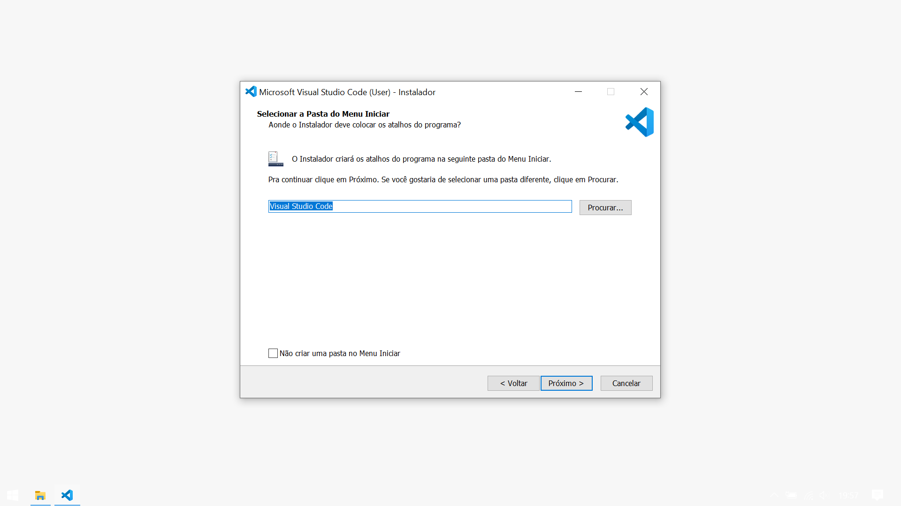
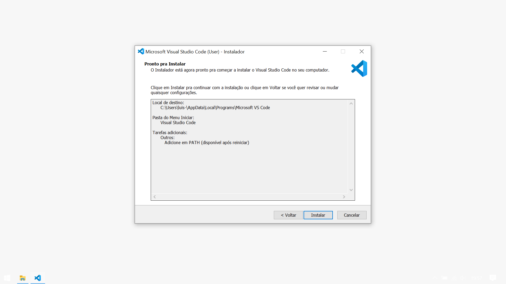
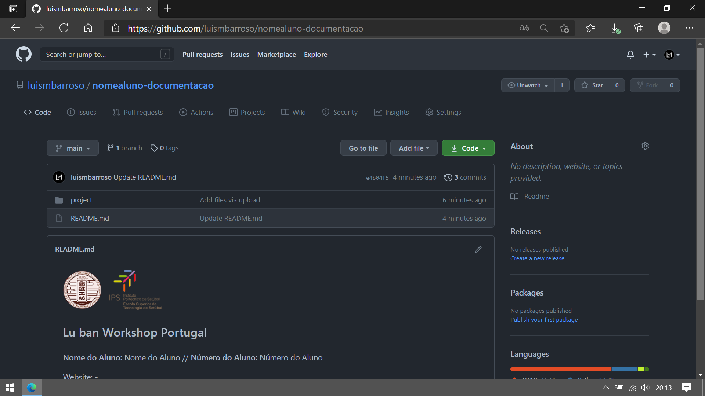
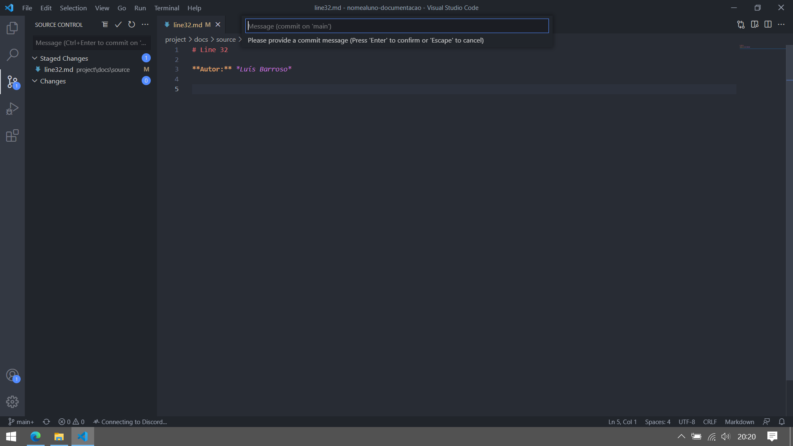

<h2>IPS - Escola Superior de Tecnologia de Setúbal - Lu Ban Workshop Portugal
</h2>
  
  

# Primeiros Passos

**Autor:** Luis Barroso

## Indice
- [Objetivo](#objetivo)
- [Conceitos](#conceitos)
- [Programas](#programas)
    - [Visual Studio Code](#visual-studio-code)
    - [Git](#git)
- [Instalação](#instalação)
    - [Visual Studio Code](#visual-studio-code)
    - [Git](#git)

## Objetivo
## Conceitos
## Programas
### Visual Studio Code
### Git
## Instalação
### Visual Studio Code
### Git

# 1

# 2

# 3

# 4

# 5

# 6

