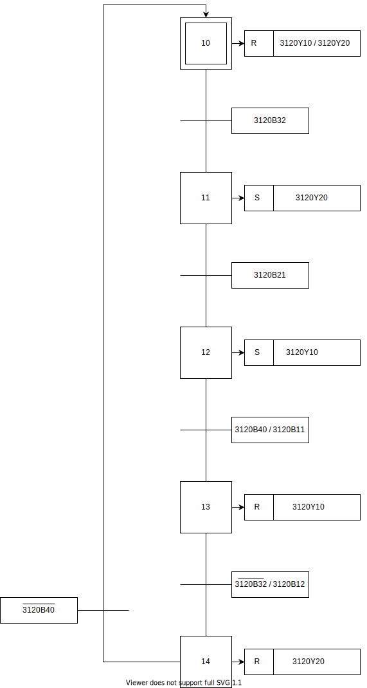
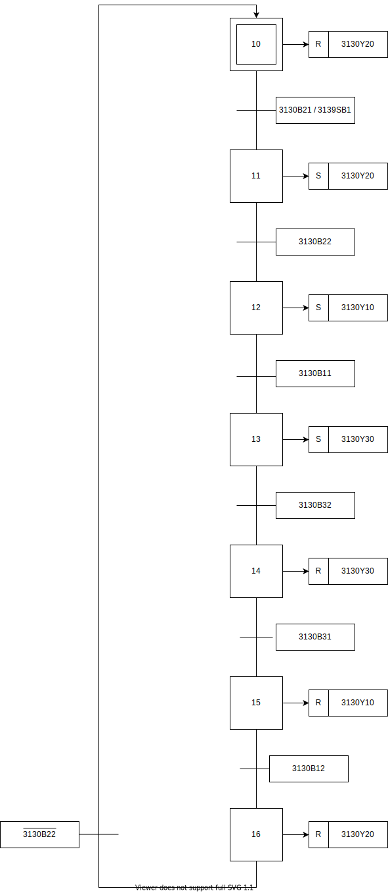
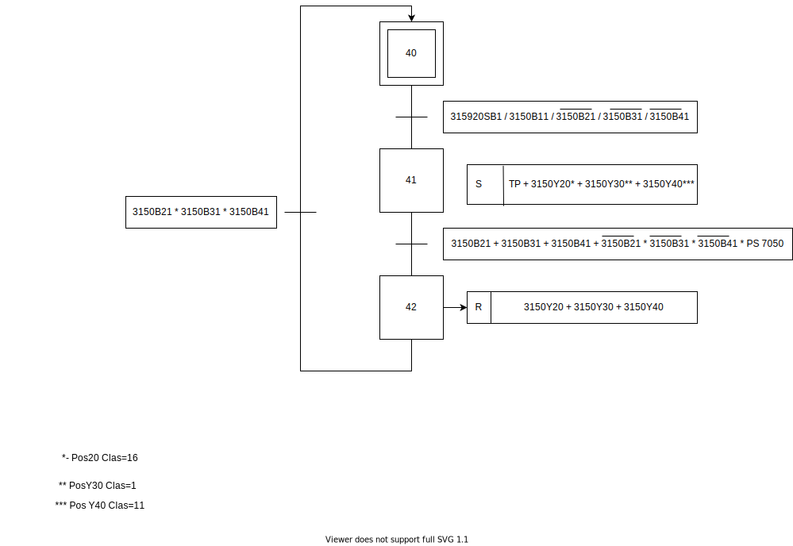
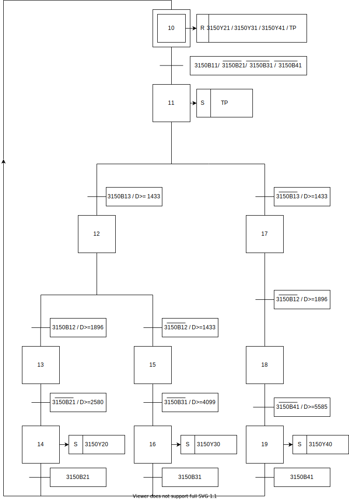

# Line 31

### Indice
- [Introdução](#introducao)
- [Trabalho Realizado](#trabalho-realizado)
   - [Grafcets](#grafcets)
        - [Estação 10 ](#estacao-10)
        - [Estação 20 ](#estacao-20)
        - [Estação 30 ](#estacao-30) 
        - [Estação 40 ](#estacao-40)
        - [Estação 50 ](#estacao-50)
   - [Fluxograma](#Fluxograma)
   - [Classificacao](#Classificacao)

### Introdução

A Line 31 é uma das Lines do Grupo 30. Divida em 5 estações das quais resultam: **"Transporte"**,**"Pressurização"**, **"Alimentação (Corpo e Miolo)"** e **"Seleção"**.

### Trabalho Realizado
#### Grafcets 
##### Estação 10 

##### Estação 20

##### Estação 30

##### Estação 40

Upgrade 04/05/2021, 14h53

##### Estação 50
###### Com Rejeicao

###### Sem rejeicao

#### Fluxograma
##### Estação 50
###### Fluxograma Inteiro

.svg)

###### Fluxograma por Partes

.svg)

#### Classificacao
##### Estacao 10

##### Estacao 20							
|Tags|	Inputs|	Legend|		Tags|	Outputs|	Legend|
|----|--------|-------|---------|----------|----------|
|3120B21|I0.0|Sensor de frente	|3120Y20|Q0.0	|Cilindro Superior|	
|3120B22|I0.1|Sensor de Trás	|3120Y10|Q0.1	|Cilindro Inferior|	
|3120B11|I0.2|Sensor de Frente	|292011	|Q0.7	|Luz Laranja|	
|3120B12|I0.3|Sensor de Trás	|292012	|Q1.0	|Luz Verde|	
|3120B40|I0.4|Sensor Base		|292013	|Q1.1	|Luz Vermelha|	
|3120B31|I0.5|Sensor de Cima(Tubo)					
|3120B32|I0.6|Sensor de Baixo(Tubo)					
|3120B33|I0.7|Sensor Metálico(Tubo)					
|3129SB2|I1.2|Stop					
|3129SB1|I1.3|Start					
|3129QS	|I1.4|Switch de Emergência					
|3120SA	|I1.5|Switch ON/OFF					

##### Estacao 30
|Tags	|Inputs	|Legend		|Tags	|Outputs	|Lengend|
|-------|-------|-----------|-------|-----------|-------|	
|3130B21	|I0.0	|Sensor Garra		|3130Y20	|Q0.0	|Garra|	
|3130B22	|I0.1	|Sensor Garra Fechada|3130Y10	|Q0.2	|Base|	
|3130B11	|I0.2	|Sensor de Trás (Base)|3130Y30	|Q0.3	|Prensa|	
|3130B12	|I0.3	|Sensor de Frente(Base)|392011	|Q0.7	|Luz Laranja|	
|3130B31	|I0.4	|Sensor de Pos.Rec(Prensa)		|392012	|Q1.0	|Luz Verde|	
|3130B32	|I0.5	|Sensor de Pos.Av(Prensa)		|392013	|Q1.1	|Luz Vermelha|	
|3139SB2	|I1.2	|Stop					
|3139SB1	|I1.3	|Start					
|3139QS	|I1.4	|Switch de Emergência					
|3139SA	|I1.5	|Switch ON/OFF					

##### Estacao 40
|Tags	|Inputs	|Legend		|Tags	|Outputs	|Legend	|
--------|-------|-----------|-------|-----------|-------|
|314020B11|	I0.0|	Sensor Tubo em cima|314020Y10|	Q0.0	|Cilindro Baixo do Tubo	
|314020B10|	I0.1|	Sensor Tubo em baixo|314020Y20|	Q0.1|Cilindro Cima do Tubo	
|314010B31|	I0.2|	Sensor Prato lado Esq.|314010R10|	Q0.2	|Prato	
|314010B30|	I0.3|	Sensor Prato lado Dir.|		314030G10|	Q0.3	|Garra	
|314010B10|	I0.4|	Sensor Tubo	|	314030Y20|	Q0.4|	Cilindro Vertical	
|314020B21|	I0.5|	Sensor á Frente|		314030Y10|	Q0.5|	Cilindro Horizontal	
|314020B20|	I0.6|	Sensor a trás|		314040HL10|	Q0.6|	Semáforo Encarnado	
|314020B30|	I0.7|	Sensor á Frente|		314040HL20|	Q0.7|	Semáforo Laranja	
|314020B31|	I1.0|	Sendor a trás|		314040HL30|	Q1.0|	Semáforo Verde	
|314010B20|	I1.1|	Sensor posição inicial|		4920HL1|	Q8.5|	Luz Laranja	
|314030B21|	I1.2|	Sensor Mov.(Prato)|		4920HL2|	Q8.6|	Luz Verde	
|314030B10|	I1.3|	Sensor Garra|		4920HL3|	Q8.7|	Luz Vermelha	
|314930B41|	I1.4|	Sensor de Garra em baixo|					
|314030B40|	I1.5|	Sensor de garra em cima|					
|314030B51|	I8.0|	Sensor de Trás|					
|314030B50|	I8.1|	Sensor de Frente|					
|3149SB1|	I8.5|	Start|					
|3149QS|	I8.6|	Switch de Emerg.|					
|3149SA|	I8.7|	Switch ON/OFF|	

##### Estacao 50
|Tags	|Inputs	|Legend		|Tags	|Outputs	|Legend	|
--------|-------|-----------|-------|-----------|-------|
||I0.0	|Encoder(Fase A)		|TP	|Q0.0	|Motor (Rotação Av)	|
||I0.1	|Encoder(Fase B)		|TP(1)	|Q0.1	|Motor (Rotação Rec)|	
||I0.2	|Encoder(Fase C)		|3150Y20	|Q0.4	|Cilindro 1	|
|3150B11	|I0.3	|Sensor de Material		|3150Y30	|Q0.5	|Cilindro 2	|
|3150B12	|I0.4	|Sensor de Metálico		|3150Y40	|Q0.6	|Cilindro 3|	
|3150B13	|I1.1	|Sensor(Cilindro 3)	|				
|3159SB2	|I1.2	|Stop|					
|3159SB1	|I1.3	|Start	|				
|3159QS	|I1.4	|Switch de Emerg.|					
|3159SA	|I1.5	|Switch ON/OFF	|				
