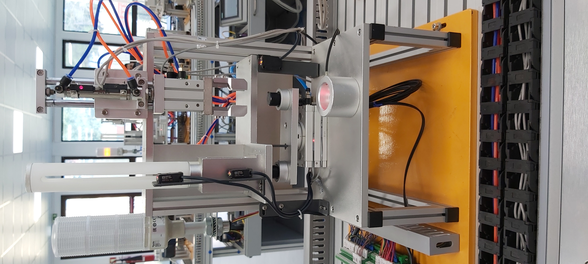

# Line 32

- [Introdução](#introdução)
- [Processo](#processo)
- [Modos de Funcionamento](#modo-de-funcionamento)
- [Trabalho Realizado](#trabalho-realizado)
    - [Classificação](#classificacao)
        - [Estação 10](#estação-10)
        - [Estação 20](#estação-20)
        - [Estação 30](#estação-30) 
        - [Estação 40](#estação-40)
        - [Estação 50](#estação-50)   
    - [Software](#software)
        - [Grafcets Modo: Manual](#grafcets-modo:-manual)
            - [Estação 10 (Manual)](#estação-10-manual)
            - [Estação 20 (Manual)](#estação-20-manual)
            - [Estação 30 (Manual)](#estação-30-manual) 
            - [Estação 40 (Manual)](#estação-40-manual)
            - [Estação 50 (Manual)](#estação-50-manual)
        - [Grafcets Modo: Automático](#grafcets-modo:-automático)	
            - [Estação 10 (Automático)](#estação-10-automático)
            - [Estação 20 (Automático)](#estação-20-automático)
            - [Estação 30 (Automático)](#estação-30-automático) 
            - [Estação 40 (Automático)](#estação-40-automático)
            - [Estação 50 (Automático)](#estação-50-automático)
        - [Gemma](#gemma)
            - [Projeto 1](#projeto-1)
 

## Introdução

A Line 32 é uma das Lines do Grupo 30. Divida em 5 estações das quais resultam: **"Transporte (Estação 10)"**, **"Aplicação (Estação 30)"**, **"Alimentação (Corpo (Estação 20) e Miolo (Estação 40))"** e **"Seleção (Estação 50)"**.

## Processo

    Notas: 
    # Falar um pouco da Line
    # Processo de funcionamento da estacao

**Estação 10**

A Estação 10, **estação de transporte da peça**, desde a sua fase inicial até à sua finalização. Para a realização deste transporte pelas diversas estações é utilizado um **robô**, que acoplado, contém uma **garra**, sendo assim possivel realizar as tarefas pretendidas. Para se deslocar pelas diversas estações, o **robô**, está conectado a um Servo Motor (Simotics S-1FL6) e um inversor de Frequência (Siemens V90). Agregada à estação 10, temos a subestação 11, constituida por 4 cilindros: Cilindro 1 responsável por fazer o avanço e recuo da garra; Cilindro 2 responsável por fazer a subida e descida da garra; Cilindro 3 responsável por fazer a rotação da garra para a esquerda ou direita; Cilindro 4 responsável por fazer a abertura e fecho da garra; 

    Nota: Diferentes as restantes estações e respetivos cilindros, o Cilindro 1 e 3 eletrovalvulas monoestaveis.

**Estação 20**

A Estação 20, **estação de alimentação do corpo da peça**, o corpo da peça, é colocado na funil para ser processado. Agregada à estação 20, temos a subestação 21, constituida por 2 cilindros: Cilindro 1 responsável por fazer o avanço da primeira peça; Cilindro 2 responsável prender a segunda peça, evitando assim, que a segunda peça caia antes do Cilindro 1 recuar.

**Estação 30**

A Estação 30, **estação de aplicação**, é aplicada uma *cola* para fixar o miolo ao corpo da peça. Agregada à estação 30, temos a subestação 31, constituida por 3 cilindros: Cilindro 1 responsável por fazer o fecho da pinça; Cilindro 2 responsável por fazer avanço e recuo da pinça; Cilindro 3 responsável por fazer a subida e a descida da prensa.

**Estação 40**

A Estação 40, **estação de alimentação do miolo da peça**, o miolo da peça, é colocado na funil para ser processado. Agregada à estação 40, temos a subestação 41, constituida por 3 cilindros: Cilindro 1 responsável pelo suporte do miolo, quando ativado deixa o miolo cair; Cilindro 2 responsável prender a segunda peça, evitando assim, que a segunda peça caia antes do Cilindro 1 recuar; Cilindro 3 responsavel pelo movimento do prato. Ainda na estação 40, temos a subestação 42, constituida por 3 cilindros: Cilindro 1 responsável por fazer avanço e recuo da garra; Cilindro 2 responsável por fazer a subida e a descida da garra. Cilindro 3 responsavel pelo fecho e abertura da garra. 

**Estação 50**

A Estação 50, **estação de seleção**, responsável por ordenar as peças no respsetivo armazém. Agregada à estação 50, temos o tapete, onde se encontram os 3 cilindros que constituem o processo: Cilindro 1 responsável por encaminhar a peça, Corpo/Miolo Metálico; Cilindro 2 responsável por encaminhar a peça, Corpo/Miolo Branco; Cilindro 3 responsável por encaminhar a peça, Corpo/Miolo Preto.

## Trabalho Realizado
### Classificação
#### Estação 10
*Entradas dos 19PLC*

|Label |Endereço  | Comentário|
--- | --- | ---
3211*B42|%I0.3|Sensor de Garra em Baixo
3211*B41|%I0.4|Sensor de Garra em Cima
3211*B32|%I0.5|Sensor Garra (Rotação)
3211*B31|%I0.6|Sensor Garra (Posição Inicial)
3211*B21|%I0.7|Sensor de Garra á Frente
3211*B22|%I1.0|Sensor de Garra Atrás
3211*B11|%I1.1|Sensor de Garra Fechada
321920SB22|%I8.4|Botão Vermelho
321920SB21|%I8.5|Botão Verde
321920QS24|%I8.6|Botão Emergência
321920SA23|%I8.7|Seletor

*Saidas dos 19PLC*

|Label |Endereço  | Comentário|
--- | --- | ---
3211*Y40|%Q0.3|Cilindro da Garra (Sobe e Baixa)
3211*Y30B|%Q0.4|Cilindro da Garra (Rotação)
3211*Y30A|%Q0.5|Cilindro da Garra (Posição Inicial)
3211*Y20|%Q0.6|Cilindro da Garra (Frente e Atrás)
3211*Y10B|%Q0.7|Cilindro de Fecho Garra
3211*Y10A|%Q1.0|Cilindro de Abertura da Garra
321920HL11|%Q8.5|Painel Luz Laranja
321920HL12|%Q8.6|Painel Luz Verde
321920HL13|%Q8.7|Painel Luz Vermelha

#### Estação 20
*Entradas dos 29PLC*

|Label |Endereço  | Comentário|
--- | --- | ---
3220*B11|%I0.4|Sensor de Peça à Frente
3221*B11|%I0.0|Sensor Cilindro1 Avançado
3221*B12|%I0.1|Sensor Cilindro1 Recuado
3221*B21|%I0.2|Sensor Cilindro2 Avançado
3221*B22|%I0.3|Sensor Cilindro2 Recuado
3221*B32|%I0.5|Sensor no Copo (Cima)
3221*B33|%I0.6|Sensor no Copo (Baixo)
3221*B31|%I0.7|Sensor de Peça Metálica
322920SB22|%I1.2|Botão Vermelho
322920SB21|%I1.3|Botão Verde
322920QS24|%I1.4|Botão Emergência
322920SA23|%I1.5|Seletor

*Saidas dos 29PLC*

|Label |Endereço  | Comentário|
--- | --- | ---
3221*Y10|%Q0.0|Cilindro 1
3221*Y20|%Q0.1|Cilindro 2
322920HL11|%Q0.7|Painel Luz Laranja
322920HL12|%Q1.0|Painel Luz Verde
322920HL13|%Q1.1|Painel Luz Vermelha

#### Estação 30
*Entradas dos 39PLC*

|Label |Endereço  | Comentário|
--- | --- | ---
3231*B11|%I0.0|Sensor Peça na Pinça
3231*B21|%I0.1|Sensor da Pinça (Abrir/Fechar)
3231*B31|%I0.2|Sensor de Pinça Avancada
3231*B32|%I0.3|Sensor de Pinça Recuada
3232*B11|%I0.4|Sensor de Prensa Subida
3232*B12|%I0.5|Sensor de Prensa Descida
323920SB22|%I1.2|Botão Vermelho
323920SB21|%I1.3|Botão Verde
323920QS24|%I1.4|Botão Emergência
323920SA23|%I1.5|Seletor

*Saidas dos 39PLC*

|Label |Endereço  | Comentário|
--- | --- | ---
3231*Y20|%Q0.0|Cilindro de Fechar a Pinça
3231*Y20|%Q0.2|Cilindro da Pinça (Avanço e Recuo)
3232*Y10|%Q0.3|Cilindro da Prensa (Sobe e Desce)
323920HL11|%Q0.7|Painel Luz Laranja
323920HL12|%Q1.0|Painel Luz Verde
323920HL13|%Q1.1|Painel Luz Vermelha

#### Estação 40
*Entradas dos 49PLC*

|Label |Endereço  | Comentário|
--- | --- | ---
3241*B11|%I0.5|Sensor Cilindro1 Avançado
3241*B12|%I0.6|Sensor Cilindro1 Recuado
3241*B21|%I0.7|Sensor Cilindro2 Avançado
3241*B22|%I1.0|Sensor Cilindro2 Recuado
3241*B31|%I1.1|Sensor Prato (Posição Inicial)
3241*B32|%I1.2|Sensor Prato (Rotação)
3241*B41|%I0.0|Sensor no Copo (Cima)
3241*B42|%I0.1|Sensor no Copo (Baixo)
3241*B43|%I0.2|Sensor do Prato (Esquerdo)
3241*B44|%I0.3|Sensor do Prato (Direito)
3242*B11|%I8.1|Sensor de Garra á Frente
3242*B12|%I8.0|Sensor de Garra Atrás
3242*B21|%I1.5|Sensor de Garra em Cima
3242*B22|%I1.4|Sensor de Garra em Baixo
3242*B31|%I1.3|Sensor de Garra (Abrir/Fechar)
3242*B41|%I0.4|Sensor de Peça à Frente
324920SB22|%I8.4|Botão Vermelho
324920SB21|%I8.5|Botão Verde
324920QS24|%I8.6|Botão Emergência
324920SA23|%I8.7|Seletor

*Saidas dos 49PLC*

|Label |Endereço  | Comentário|
--- | --- | ---
3240*H13|%Q0.6|Semáforo Vermelho
3240*H12|%Q0.7|Semáforo Amarelo
3240*H11|%Q1.0|Semáforo Verde
3241*Y10|%Q0.1|Cilindro 1 Tubo
3241*Y20|%Q0.0|Cilindro 2 Tubo
3241*Y30|%Q0.2|Prato
3242*Y10|%Q0.5|Cilindro da Garra (Frente e Tras)
3242*Y20|%Q0.4|Cilindro da Garra (Cima e Baixo)
3242*Y30|%Q0.3|Cilindro da Garra (Abrir e Fechar)
324920HL11|%Q8.5|Luz do Painel (Laranja)
324920HL12|%Q8.6|Luz do Painel (Verde)
324920HL13|%Q8.7|Luz do Painel (Vermelha)

#### Estação 50
*Entradas dos 59PLC*

|Label |Endereço  | Comentário|
--- | --- | ---
Enconder_A|%I0.0|Enconder A
Enconder_B|%I0.1|Enconder B
Enconder_Z|%I0.2|Enconder Z
325010B11|%I0.3|Sensor de Peça (Tapete)
325010B13|%I0.4|Sensor de Peça Metálica
325010B12|%I0.5|Sensor de Peça Branca/Metálica
325010B21|%I0.7|Sensor Cilindro1 Avançado
325010B31|%I1.0|Sensor Cilindro2 Avançado
325010B41|%I1.1|Sensor Cilindro3 Avançado
325920SB22|%I1.2|Botão Vermelho
325920SB21|%I1.3|Botão Verde
325920QS24|%I1.4|Botão Emergência
325920SA23|%I1.5|Seletor

*Saidas dos 59PLC*

|Label |Endereço  | Comentário|
--- | --- | ---
3250M51A|%Q0.0|Inversores de Freq. (Frente)
3250M51B|%Q0.1|Inversores de Freq. (Atrás)
325010Y20|%Q0.4|Cilindro 1
325010Y30|%Q0.5|Cilindro 2
325010Y40|%Q0.6|Cilindro 3
325920HL11|%Q0.7|Luz do Painel (Laranja)
325920HL12|%Q1.0|Luz do Painel (Verde)
325920HL13|%Q1.1|Luz do Painel (Vermelha)

### Software
#### Grafcets Modo: Manual
##### Estação 10 (Manual)

##### Estação 20 (Manual)

##### Estação 30 (Manual)

##### Estação 40 (Manual)

##### Estação 50 (Manual)

#### Grafcets Modo: Automático
##### Estação 10 (Automático)

##### Estação 20 (Automático)

##### Estação 30 (Automático)

##### Estação 40 (Automático)

##### Estação 50 (Automático)

# programacao

introducao
blocos importanttes

#### Gemma
- [Projeto1](./software/gemma/projeto1/gemma.md)
