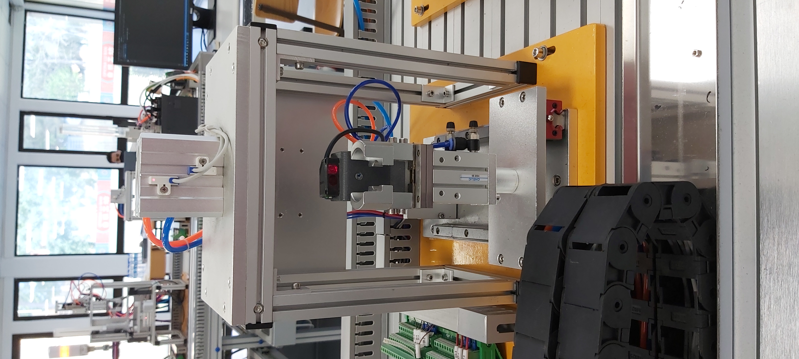

## Processo

A Line 32, do Grupo 30, consiste num conjunto de estações, **cada uma com Equipamentos/Componenetes independentes**. A Line 32, assim com cada uma da estações, funcionam usando **sistemas pneumáticos** sendo assim possivel realizar os movimentos pretendidos. 

Para o controlo das peças são usados Sensores, como: **Sensores Fotoelétricos**, usados para a detecção das peças em deterniadas posições; **Sensores Magnéticos** usados para distiguir as peças metálicas das peças de plástico; **Sensores Óticos** usados para distiguir a peças brancas das peças pretas

Para além dos **sistemas pneumáticos** também existem **sistemas eletromecânico**, na Estação 10 e 50. Na estação 10, este sistemas, são responsaveis pelo movimento do **robô**. Este robô é utilizado para o transporte das peças pelas diversas estações. Acoplado ao robô, temos uma **garra**, sendo assim possivel realizar as tarefas pretendidas. Para se deslocar pelas diversas estações, o robô, está conectado a um Servo Motor (Simotics S-1FL6) e um Inversor de Frequência (Siemens V90). Na estação 50, este sistemas, são responsáveis pelo movimento do tapete. Para o movimento deste tapete é usado um motor trifasico que acupolado tem um enconder, que, através da sua posição é possivel fazer o encaminhamento das peças, para a posição pretendida. Para a movimento do Motor é uitlizado um Inversor de Frequência (Siemens G120C), que converte o sinal elétrico em sinal analógico sendo assim possivel fazer o movimento do tapete e controlo da velocidade.

Para a comunicação entre as diversas estações é usado o protocolo de comunicação **PROFINET**, este protocolo é baseado em **Ethernet**. No programa TIA Portal é definida uma área de transferência de Bytes, desta forma, tanto o Master com os Slaves podem operar na zona defenida. 

### Peças

        

Peças, constituidas por Corpo (Parte Exterior) e por um Miolo (Parte Interior). Representa o objetvo processado na Line32, quando os elementos são unificados representam o produto final. Podem ser classificadas de 9 maneiras, como nos mostra a tabela abaixo.

||Metálico|Branco|Preto|
-| ------ | ---- | --- |
Metálico|**x**|x|x|
Branco|x|**x**|x|
Preto|x|x|**x**|

Os **x** a negrito indicanos a combinações pretendidas, quando esseas combinações são processadas são encaminhadas para o respetivo armazém.

### Estações

**Estação 10**

A Estação 10, **estação de transporte da peça**, desde a sua fase inicial até à sua finalização. Agregada à estação 10, temos a subestação 11, constituida por 4 cilindros: Cilindro 1 responsável por fazer o avanço e recuo da garra; Cilindro 2 responsável por fazer a subida e descida da garra; Cilindro 3 responsável por fazer a rotação da garra para a esquerda ou direita; Cilindro 4 responsável por fazer a abertura e fecho da garra; 

    Nota: Diferentes as restantes estações e respetivos cilindros, o Cilindro 1 e 3 eletrovalvulas monoestaveis.

    

**Estação 20**

A Estação 20, **estação de alimentação do corpo da peça**, o corpo da peça, é colocado na funil para ser processado. Agregada à estação 20, temos a subestação 21, constituida por 2 cilindros: Cilindro 1 responsável por fazer o avanço da primeira peça; Cilindro 2 responsável prender a segunda peça, evitando assim, que a segunda peça caia antes do Cilindro 1 recuar.

        

**Estação 30**

A Estação 30, **estação de aplicação**, é aplicada uma *cola* para fixar o miolo ao corpo da peça. Agregada à estação 30, temos a subestação 31, constituida por 3 cilindros: Cilindro 1 responsável por fazer o fecho da pinça; Cilindro 2 responsável por fazer avanço e recuo da pinça; Cilindro 3 responsável por fazer a subida e a descida da prensa.

        

**Estação 40**

A Estação 40, **estação de alimentação do miolo da peça**, o miolo da peça, é colocado na funil para ser processado. Agregada à estação 40, temos a subestação 41, constituida por 3 cilindros: Cilindro 1 responsável pelo suporte do miolo, quando ativado deixa o miolo cair; Cilindro 2 responsável prender a segunda peça, evitando assim, que a segunda peça caia antes do Cilindro 1 recuar; Cilindro 3 responsavel pelo movimento do prato. Ainda na estação 40, temos a subestação 42, constituida por 3 cilindros: Cilindro 1 responsável por fazer avanço e recuo da garra; Cilindro 2 responsável por fazer a subida e a descida da garra. Cilindro 3 responsavel pelo fecho e abertura da garra. 

        

**Estação 50**

A Estação 50, **estação de seleção**, responsável por ordenar as peças no respsetivo armazém. Agregada à estação 50, temos o tapete, onde se encontram os 3 cilindros que constituem o processo: Cilindro 1 responsável por encaminhar a peça, Corpo/Miolo Metálico; Cilindro 2 responsável por encaminhar a peça, Corpo/Miolo Branco; Cilindro 3 responsável por encaminhar a peça, Corpo/Miolo Preto.

        

### Modo de Funcionamento

Assim que a estação 20 é alimentada com o corpo da peça, essa informação é enviada para o PLC Master (Estação 10), assim que recebida, a peça é processada, ou seja, o cilindro avança e a peça esta pronta para o carro a processar e avançar para a proxima estação. Quando o carro estiver na posição realtiva à estação 30, a garra avança e pousa a peça na pinça e a peça é processada, quando concluido este processo o carro avança para a proxima estação. Quando o carro estiver na posição realtiva à estação 40, a garra avança e pousa a peça *suporte*. Assim que o corpo da peça for recebido pela estacão 40, a estacção entrar em processamento, ou seja, o miolo e colocado no corpo da peça. Quando concluido este processo o carro avança para a proxima estação. Quando o carro estiver na posição realtiva à estação 50, a garra avança e pousa no tapete. O tapete entra em andamento e a peça 