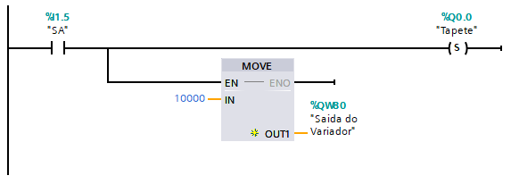

<h2>IPS - Escola Superior de Tecnologia de Setúbal - Lu Ban Workshop Portugal
</h2>

# Manual Encoder

**Autor:** ...

### Indice
- [Básico I](#basico-i)
- [Configuração Básica do Encoder no TIA Portal](#configuracao-basica-do-encoder-no-tia-portal)
- [Introdução à programação de encoders](#introducao-a-programacao-de-encoders)
  - [CTRL_HSC](#ctrl-hsc)
  - [Move](#move)
  - [Valor do %ID…](#valor-do-id)

### Básico I

Durante esta primeira parte será ensinado o básico sobre o servo. Desde as bases de configuração até às bases de programação, abordando apenas a informação essencial para
conseguir por em prática uma ideia implementando um servo no processo. Serão ainda abordados alguns conceitos básicos em relação ao servo e ao método de comunicação
utilizado (PTO). 

### Configuração Básica do Encoder no TIA Portal

1.Em **“Device configuration”** clique com o botão direito sobre o PLC e selecione o opção **“Properties”**.

*Imagem 1*

2.Na aba **“High speed counters (HSC)”**, abra **“HSC1”** e clique em **“General”** e de seguida marque a opção **“Enable this high speed counter”**.

*Imagem 2*

3.Ainda na aba **“HSC1”** vá a **“Function”** e em **“Operating phase”** escolha a opção **“A/B Counter”**.

*Imagem 3*

4.Em **“Hardware inputs”** certifique-se de que tem as entradas devidamente ligadas com o encoder, e de que as mesmas são entradas de alta velocidade.

*Imagem 4*

5.De seguida na aba **“DI 14/DQ 10”** vá em **“Digital inputs”** e clique nos **“Channels”** (exemplo Channel0 e Channel1 para as entradas %I0.0 e %I0.1) correspondentes às entradas de alta velocidade configuradas no passo anterior, e escolha o filtro de sinal adequado para a sua utilização.

*Imagem 5*

6.E a configuração do Encoder está concluída.

### Introdução à programação de encoders
A programação de encoders é bastante simples uma vez que na base a sua programação passa por apenas fazer leituras dos valores do encoder e aplicar alguns ajustes às configurações do encoder ao longo do processo.

#### CTRL_HSC
O CTRL_HSC contém um endereço, este é um endereço de um intervalo configurado para o encoder nas propriedades do contador de alta velocidade. Á medida que o tapete se move, esse valor irá também aumentar, desta forma, é possivel defenir o caminho que cada peça toma. No exemplo que iremos demostrar, usamos o HSC1, por padrão o endereço a utilizar é %ID1000.

    NOTA: Para saber o endereço do HSC que está usar, dois cliques em "Device configuration > System constants Device configuration > General > (Seleciona o HSC que está a usar) > I/O adreesses"

**Principais parâmetros:**
- **HSC:** Endereço do HSC
- **CV:** Quando ativado, permite uma nova contagem

        NOTA: O Endereço do HSC pode ser encontrado em "Device configuration > System constants"

*Imagem 6*

#### Move
O Move é função que permite, como o próprio nome indica, mover valores de entrada de forma a serem aplicados numa saida. No exemplo que iremos demostrar, usaremos a função **"Move"** para colocar o tapete em funcionamento. 

    NOTA: A Variável colocada na saida do Move "%QW80" é o Output padrão da Carta analógico do PLC.  O Endereço do HSC pode ser encontrado em "Device configuration > System constants"

*Imagem 7*

#### Valor do %ID...
Para consultar o valor do %ID..., pode usar uma **"Whatch Table"**

*Imagem 8*
